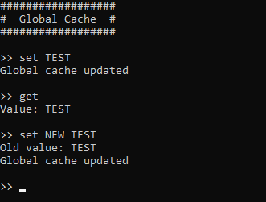

# ItsMyConsole.Tools.GlobalCache
Outil Cache Global pour le Framework ItsMyConsole

## Sommaire
- [Pourquoi faire ?](#pourquoi-faire-)
- [Getting Started](#getting-started)
- [Comment se servir de l'outil ?](#comment-se-servir-de-loutil-)
- [Ajout de données dans le cache](#ajout-de-données-dans-le-cache)
- [Récupération des données du cache](#récupération-des-données-du-cache)
- [Suppression des données du cache](#suppression-des-données-du-cache)
- [Tester la présence de la clé dans le cache](#tester-la-présence-de-la-clé-dans-le-cache)
- [Récupération de toutes les clés contenues dans le cache](#récupération-de-toutes-les-clés-contenues-dans-le-cache)

## Pourquoi faire ?
Vous allez pouvoir étendre le Framework pour application Console .Net [```ItsMyConsole```](https://github.com/dtarroz/ItsMyConsole) avec un outil pour mettre en cache des données accessibles depuis toutes les interprétations de ligne de commande.

L'outil ```ItsMyConsole.Tools.GlobalCache``` met à disposition :
 - L'ajout de données en cache associé à une clé unique
 - La lecture des données en cache à partir d'une clé
 - La suppression des données du cache associés à une clé
 - La vérification de la présence d'une clé contenue dans le cache
 - La récupération de toutes les clés contenues dans le cache

## Getting Started
1. Créer un projet **"Application Console .Net"** avec le nom *"MyExampleConsole"*
2. Ajouter [```ItsMyConsole```](https://github.com/dtarroz/ItsMyConsole) au projet depuis le gestionnaire de package NuGet
3. Ajouter ```ItsMyConsole.Tools.GlobalCache``` au projet depuis le gestionnaire de package NuGet
4. Dans le projet, modifier la méthode **"Main"** dans le fichier **"Program.cs"** par le code suivant :
```cs
using ItsMyConsole;
using ItsMyConsole.Tools.GlobalCache;
using System;
using System.Threading.Tasks;

namespace MyExampleConsole
{
    class Program
    {
        static async Task Main() 
        {
            ConsoleCommandLineInterpreter ccli = new ConsoleCommandLineInterpreter();

            // Console configuration
            ccli.Configure(options => 
            {
                options.Prompt = ">> ";
                options.LineBreakBetweenCommands = true;
                options.HeaderText = "##################\n#  Global Cache  #\n##################\n";
                options.TrimCommand = true;
            });

            // Update global cache
            // Example : set MyNewValue
            ccli.AddCommand("^set (.+)$", RegexOptions.IgnoreCase, tools => 
            {
                string value = tools.CommandMatch.Groups[1].Value;
                const string key = "<KEY>";
                if(tools.GlobalCache().Contains(key))
                {
                    string oldValue = tools.GlobalCache().Get<string>(key);
                    Console.WriteLine($"Old value: {oldValue}");  
                }
                tools.GlobalCache().Update(key, value)
                Console.WriteLine("Global cache updated");
            });
            
            // Get the value in the global cache 
            // Example : get
            ccli.AddCommand("^get$", RegexOptions.IgnoreCase, tools => 
            {
                string value = tools.GlobalCache().Get<string>("<KEY>");
                Console.WriteLine($"Value: {value}"); 
            });

            await ccli.RunAsync();
        }
    }
}
```

Voici le résultat attendu lors de l'utilisation de la Console :

 

Dans cet exemple de code on a configuré avec ```Configure```, le prompt d’attente des commandes ```options.Prompt```, la présence d'un saut de ligne entre les saisies ```options.LineBreakBetweenCommands``` et l’en-tête affichée au lancement ```options.HeaderText```. 

Puis avec le premier ```AddCommand```, on a ajouté un pattern d’interprétation des lignes de commande ```^set (.+)$``` *(commence par **"set"** et suivi d'un texte)*  qui est insensible à la casse ```RegexOptions.IgnoreCase```.

Et avec le deuxième ```AddCommand```, on a ajouté un pattern d’interprétation des lignes de commande ```^get$``` *(seulement **"get"**)*  qui est insensible à la casse ```RegexOptions.IgnoreCase```.

Lors de l'exécution de la Console, si on saisit une commande qui commence par **"set"** avec un texte à la suite, il lancera l'implémentation de l'action associée (le premier ```AddCommand```). Il commencera à lire le texte saisi (qui sera la nouvelle valeur à mettre en cache) en utilisant ```tools.CommandMatch``` depuis les outils disponibles *(résultat du Match de l'expression régulière)*. Ensuite il vérifie si on a déjà une valeur en cache ```tools.GlobalCache().Contains```, si c'est le cas, il récupére la valeur ```tools.GlobalCache().Get``` et il affiche le résultat (*"Old value"*) puis il met à jour le cache avec la nouvelle valeur ```tools.GlobalCache().Update```.

Si on saisit la commande **"get"**, il lancera l'implémentation de l'action associée (le deuxième ```AddCommand```). Il lira le cache ```tools.GlobalCache().Get``` et affichera la valeur obtenue.

Dans cet exemple, il lit et met à jour le cache sur une seule et unique clé **"&lt;KEY&gt;"** qui est accessible sur plusieurs actions configurées.

Maintenant que l'on a configuré la Console et l'implémentation des actions, l'utilisation de ```RunAsync``` lance la mise en attente d'une saisie de commande par l'utilisateur.

## Comment se servir de l'outil ?
*coming soon*

## Ajout de données dans le cache
*coming soon*

## Récupération des données du cache
*coming soon*

## Suppression des données du cache
*coming soon*

## Tester la présence de la clé dans le cache
*coming soon*

## Récupération de toutes les clés contenues dans le cache
*coming soon*
